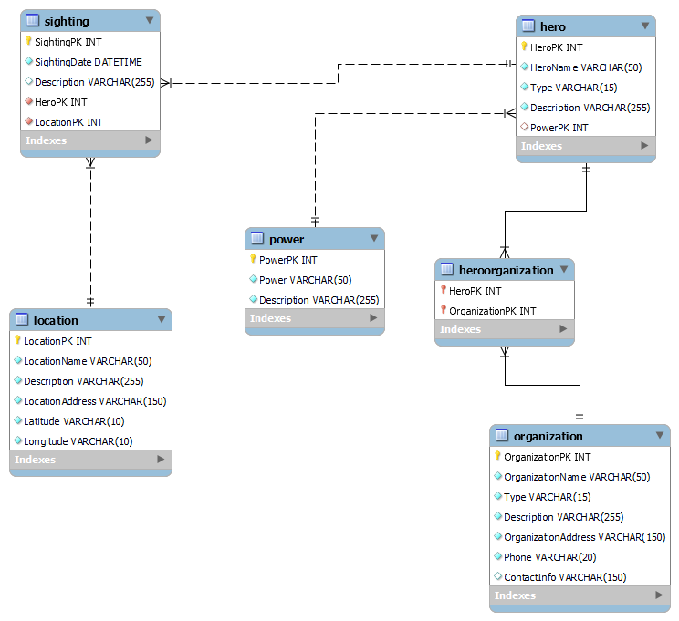

# SuperheroSighting1

In a world full of superheroes, managing their information and abilities efficiently is crucial. 
The Superhero Management System is a comprehensive web application designed to help you keep track of your favorite 
superheroes, their abilities, and their remarkable stories. Whether you're a fan, a collector, or just curious, 
this platform is here to provide an enjoyable and organized superhero experience.

## Features

- Superhero Catalog: Explore an extensive collection of both superheroes and supervillains.
- Hero/Villain Profiles: Access in-depth information about each character, including their name, powers, and classification.
- Organization Affiliation: Characters can belong to one or more superhero or supervillain organizations.
- Location Management: Keep precise records of various locations within the superhero universe.
- Interactive Home Page: Enjoy a dynamic home page featuring essential application details, seamless navigation to all sections, and a newsfeed highlighting the latest 10 sightings stored in the database.

## Entity Relationship Diagram (ERD):

